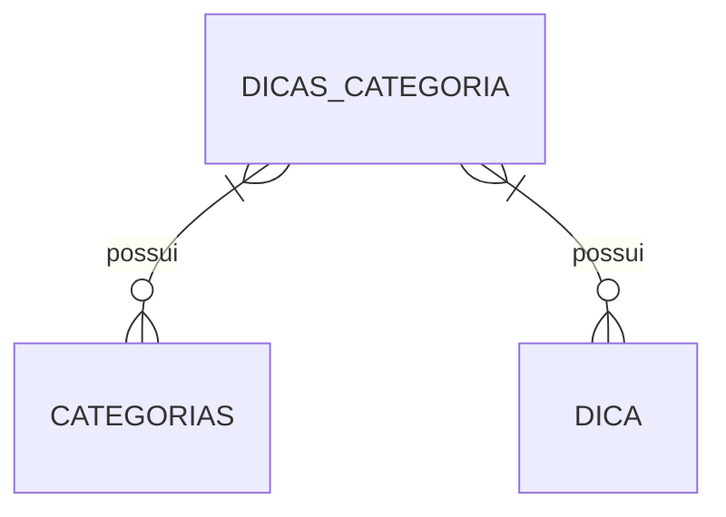
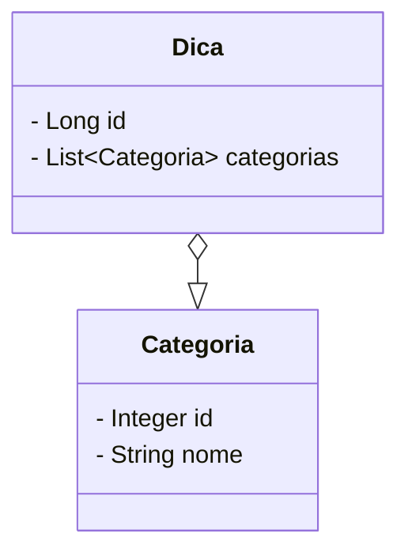

## Tutorial API - PARTE I

Nesta seção iremos criar os resources das dicas para nossos Devs; teremos inicialmente um recurso para gerenciar as dicas da API.

### Melhorias no ExceptionConfig

Iremos criar nossas exceções com o máximo de informações possíveis para similirade com as exceções padronizadas do Spring Boot. Iremos cria nossa própria classe para representação de exceções.

1. No pacote `security/exceptions` crie a classe `StandardError.java`, nela iremos padronizar os retornos da nossas exceções.

```java
public class StandardError implements Serializable {
    
    private Long timestamp;
	private Integer status;
	private String error;
	private String message;
	private String path;
	
	public StandardError(Long timestamp, Integer status, String error, String message, String path) {
		super();
		this.timestamp = timestamp;
		this.status = status;
		this.error = error;
		this.message = message;
		this.path = path;
	}

    // Getters e Setters abaixo
}
```

2. No mesmo pacote crie a classe `ObjectNotFoundException.java`, esta classe irá representar as exceções ocorridas em diversificadas consultas à API.

```java
public class ObjectNotFoundException extends RuntimeException{

    public ObjectNotFoundException(String message) {
        super(message);
    }
    
}
```

3. Na classe `ExceptionConfig` adicione o método `notFoundException`. Neste método adicionamos a classe `HttpServletRequest` para podermos incluir a URI da requisição atual. No método, é feita a criação de um objeto StandardError com as informações da exceção capturada para que elas apareçam no retoprno da requisção. As demais serão inclusas posteriormente.

```java
    @ExceptionHandler(ObjectNotFoundException.class)
    public ResponseEntity<StandardError> notFoundException(ObjectNotFoundException e, HttpServletRequest request) {

        StandardError error = new StandardError(System.currentTimeMillis(), HttpStatus.NOT_FOUND.value(),
                "Não encontrado",
                e.getMessage(), request.getRequestURI());

        return ResponseEntity.status(HttpStatus.NOT_FOUND).body(error);
    }
```

A classe `ExceptionConfig` deve ser incrementada conforme a necidade da API para com as exceções necessárias no fluxos desenvolvidos. Por exemplo, para os métodos do Framework que lancem `IllegalArgumentException` podemos utilizar o exemplo abaixo.

```java
    @ExceptionHandler(IllegalArgumentException.class)
    public ResponseEntity<StandardError> illegalArguments(IllegalArgumentException e, HttpServletRequest request) {

        StandardError error = new StandardError(System.currentTimeMillis(), HttpStatus.BAD_REQUEST.value(),
                "Bad Request",
                e.getMessage(), request.getRequestURI());

        return ResponseEntity.status(HttpStatus.BAD_REQUEST).body(error);
    }
```

### Model/Domain Layer

Agora iremos implementar os recursos da API para com as dicas de desenvolvimento em si; utilizaremos somente duas entidades.

#### Modelo Entidade-Relaciomento



#### Diagrama de Classes



### Implementação do Modelo

1. Cria a classe `Categoria.java`  no pacote `domain`.

```java
@Entity
public class Categoria {
    
    @Id
    @GeneratedValue(strategy = GenerationType.IDENTITY)
    private Integer id;

    @Column(nullable = false, length = 50)
    private String nome;

    public Categoria(String nome) {
        this.nome = nome;
    }

    public Categoria() {
    }

    // TODO: Getters e Setters
    
}
```

2. Cria a classe `Dica.java` no mesmo pacote.

```java
@Entity
public class Dica {

    @Id
    @GeneratedValue(strategy = GenerationType.IDENTITY)
    private Long id;

    @Column(nullable = false)
    private String conteudo;

    @ManyToMany
    @JoinTable(name = "dicas_categorias", 
        joinColumns = @JoinColumn(name = "id_dica", referencedColumnName = "id"), 
        inverseJoinColumns = @JoinColumn(name = "id_categoria", referencedColumnName = "id")
    )
    private Set<Categoria> categorias = new HashSet<>();

    public Dica(String conteudo) {
        this.conteudo = conteudo;
    }

    public Dica(String conteudo, Set<Categoria> categorias) {
        this.conteudo = conteudo;
        this.categorias = categorias;
    }

    public Dica() {
    }

    // TODO: Getters e Setters
}
```

3. Crie os repositories para `Categoria` e `Dica`.

### Implementação do Service

Neste trecho iremos criar o `DicaService`, nele iremos implementar as regras de negócio e o devido gerenciamento de exceções.

> A partir de agora iremos utilizar os DTOs da forma correta, ou seja, iremos trafegar os dados da API apenas por DTOs, as Entities serão utilizadas apenas para operações de persistencia com os repositories. Para tal necessitaremos realizar conversões nas R.Ns. 

1. Na classe `AppConfig` crie um Bean para utilizarmos o ModelMapper. Adicione os trecho abaixo à classe

```java
    @Bean
    public ModelMapper getMapper() {
        return new ModelMapper();
    }
```

2. Crie a classe `DicasService.java` no pacote `service`. Inclua a anotação `@Service` e inclua as dependências do repository e mapper.

```java
@Service
public class DicasService {

    @Autowired
    private ModelMapper mapper;

    @Autowired
    private DicasRepository repository;
}
```

3. Crie o método `obterTodas()`. Este método irá realizar uma chamada ao repository e lançará um exceção quando não houver registros no banco de dados; a exceção será capturada pelo `ExceptionConfig`, nosso ControllerAdvice e retornará o json com os dados contidos na classe `StandardError`, status code 404 e os demais dados da requisição.

```java
    public List<Dica> obterTodas() {
        List<Dica> dicas = repository.findAll();

        if (dicas.isEmpty()) {
            throw new ObjectNotFoundException("Ainda não foram cadastradas nenhuma dica.");
        }

        return dicas;
    }
```

4. Crie o resource `DicasResource.java`  no pacote `api/v1/resource` e inclua as dependencias do serice, mapper. 

```java
@RestController
@RequestMapping("/api/v1/dicas")
public class DicasResource {

    @Autowired
    private DicasService service;
    @Autowired
    private ModelMapper mapper;

    @GetMapping("/todas")
    public ResponseEntity<?> getAll() {
        return ResponseEntity.ok(service.obterTodas());
    }

    // TODO: Demais métodos
}
```

5. Crie uma requisição para o end-point `http://localhost:9000/api/v1/dicas/categorias` e realize a requisição para validar a exceção customizada.

6. Inclua o script para criar as categorias que serão incializadas com a base de dados. No arquivo `resources/data.sql` inclua o trecho abaixo.

```sql
insert into categoria (nome) values ('Spring Boot'),('Laravel'),('SOLID');
```

7. Crie a classe `DicaDTO.java` no pacote `api.v1.dto`.

```java
public class DicaDTO {

    private Long id;

    @NotBlank(message = "Conteúdo é obrigatório")
    private String conteudo;

    private Set<Categoria> categorias = new HashSet<>();

    public DicaDTO(String conteudo) {
        this.conteudo = conteudo;
    }

    public DicaDTO(String conteudo, Set<Categoria> categorias) {
        this.conteudo = conteudo;
        this.categorias = categorias;
    }

    public DicaDTO() {
    }

    //TODO: Gettters e Setters
}
```

8. Crie o método inserir, este méto pode lanças as exceções `IllegalArgumentException`; já temos um ExcptionHandler para ele.

```java
    public Dica inserir(DicaDTO dto) {
        Dica entity = mapper.map(dto, Dica.class);
        return repository.save(entity);
    }
```

9. Crie o método insert no `DicasResource`, o método irá por meio do service realizar a persistencia, se não ocoreem exceções na requisição, será criado a url do recurso criado para ser incluso no hedaer da requisição. O retorno da requisição irá retornar o estatus code 201 e irá incluir os dados do recurso no corpo da requisição. A anotação `@Valid` irá verificar se os atributos são validos sem precisarmos de lógicas adicionais.

```java
    @PostMapping("/nova")
    public ResponseEntity<?> insert(@Valid @RequestBody DicaDTO dto) {

        Dica entity = service.inserir(dto);

        URI uri = ServletUriComponentsBuilder.fromCurrentRequest()
                .path("/{id}")
                .buildAndExpand(entity.getId()).toUri();

        return ResponseEntity
                .created(uri)
                .body(mapper.map(entity, DicaDTO.class));
    }
```

10. Teste a criação de uma dica através do recurso `http://localhost:9000/api/v1/dicas/nova`. Lembre-se de utilizar o vero `POST` e incluir o corpo da requisição em json.

> Lembrando que o POST só é possível realizar por um cliente HTTP como PostMan, Insonmia e afins. Utilizem apenas o navegador para requisições GET.

```json
{
  "conteudo": "Sempre tentem utilizar o princípio [ Tell Don't Ask ] e [Fail First], ajuda demais na legilibilidade do código e utilizar as validações antes da implementação das regras de negócio é super válido, acreditem!!!",
  "categorias": [
    {
      "id": 3
    }
  ]
}
```